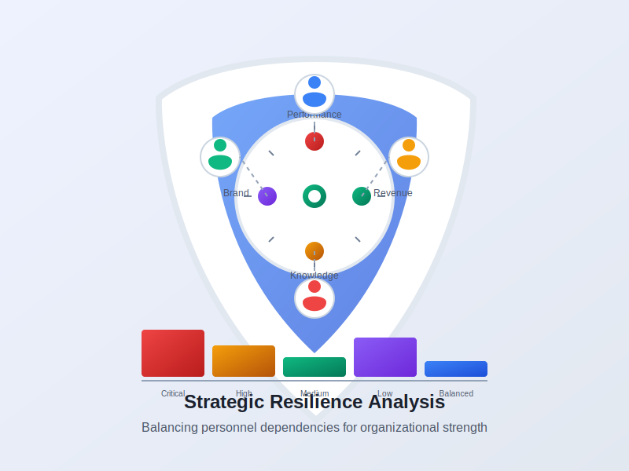

# Strategic Resilience Planner

A web application to help sports organizations assess dependency risks and build strategic resilience. This tool helps teams identify and mitigate over-reliance on key personnel to ensure long-term organizational stability.



## Features

- **Dependency Risk Assessment**: Evaluate your organization's reliance on key personnel across critical areas.
- **Impact Visualization**: View comprehensive charts and metrics showing dependency risk distribution.
- **Custom Recommendations**: Receive tailored strategies to reduce identified dependency risks.
- **Resilience Planning**: Generate strategic plans with short, medium, and long-term actions.
- **Report Generation**: Export assessment results as PDF for sharing with stakeholders.

## How It Works

1. **Identify Key Personnel**: Enter the names and roles of key individuals in your organization.
2. **Rate Impact Areas**: Assess each person's impact across five critical domains:
   - Performance Impact
   - Revenue Generation
   - Brand Value
   - Knowledge Concentration
   - Decision Authority

3. **Review Results**: Get a comprehensive analysis of your organization's dependency risks.
4. **Implement Recommendations**: Use the generated strategic plan to build organizational resilience.

## Use Cases

- **Sports Teams**: Assess reliance on star players, coaches, or executives.
- **Leagues and Federations**: Evaluate organizational structure and decision-making resilience.
- **Sports Businesses**: Identify key person risks across business operations.
- **Athletic Departments**: Ensure continuity despite personnel changes.

## Technical Information

- Built with HTML5, CSS3, and vanilla JavaScript
- Uses Bootstrap 5 for responsive design
- Chart.js for data visualization
- No backend requirements - runs entirely in the browser

## Getting Started

1. Clone this repository:
```
git clone https://github.com/dxaginfo/strategic-resilience-planner-app.git
```

2. Open `index.html` in your web browser to use the application.

## Live Demo

The application is deployed at: [https://dxaginfo.github.io/strategic-resilience-planner-app](https://dxaginfo.github.io/strategic-resilience-planner-app)

## Contribution

Contributions, issues, and feature requests are welcome. Feel free to check the [issues page](https://github.com/dxaginfo/strategic-resilience-planner-app/issues) if you want to contribute.

## License

This project is MIT licensed.

## About

The Strategic Resilience Planner was developed to address the critical challenge of key person dependency in sports organizations. By identifying and mitigating dependency risks, organizations can ensure continuity and success regardless of personnel changes.